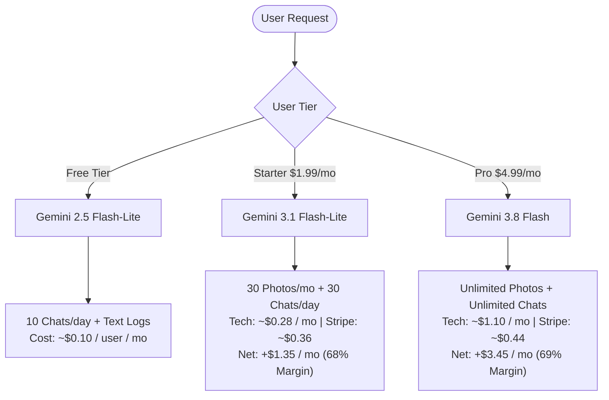

# Eating Helper — Commercial Costing Plan & Unit Economics

> **Document Version:** 1.0 (2026-09)  
> **Target Product:** Eating Helper (Multimodal AI Personal Nutritionist)  
> **Pricing Strategy:** 3-Tier Model (Free 10 chats/day, Starter \$1.99/mo, Pro \$4.99/mo)  
> **Target Net Margin:** **50%+** (including Stripe payment fees and free-tier subsidies)

---

## 1. Executive Summary & Recommended Tiers

Eating Helper uses Google Gemini multimodal models to provide plate vision analysis, personalized next-meal recommendations, interactive nutritionist chat, and nutritional plan ingestion.

To achieve a company-wide net margin above 50% while offering a generous acquisition hook, the service uses a 3-tier structure with model routing:

### Public Tier Comparison

| Feature / Metric | Tier 1: Free Tier | Tier 2: Starter | Tier 3: Pro *(Recommended)* |
| :--- | :--- | :--- | :--- |
| **Monthly Price** | **\$0.00** | **\$1.99 / month** | **\$4.99 / month** *(or \$39.99/yr = \$3.33/mo)* |
| **AI Model Behind the Scenes** | **Gemini 2.5 Flash-Lite** | **Gemini 3.1 Flash-Lite** | **Gemini 3.8 Flash (Frontier Reasoning)** |
| **Advisor Chat Drawer** | **10 chats / day** (300/mo) | **30 chats / day** (900/mo) | **Unlimited** (~100+/day + Thinking tokens) |
| **Photo Meal Logging (Vision)** | 1 photo / day *(or text only)* | 30 photos / month (1/day) | **Unlimited Photos** (High-precision vision) |
| **Text Quick Logging** | Unlimited | Unlimited | Unlimited |
| **Next Meal Suggestion Card** | 1 check / day | Unlimited checks | Unlimited proactive suggestions |
| **Nutrition Plan AI Parser** | Manual markdown only | 1 AI import / month | **Unlimited AI PDF/image plan imports** |
| **Payment Fee (Stripe 2.9% + \$0.30)** | \$0.00 | **-\$0.36** | **-\$0.44** |
| **Tech COGS (AI + DB + Proxy)** | **~\$0.10 / user / mo** | **~\$0.28 / user / mo** | **~\$1.10 / user / mo** |
| **Net Profit Per User** | **-\$0.10** *(Acquisition)* | **+\$1.35 / user / mo** | **+\$3.45 / user / mo** |
| **Standalone Net Margin** | N/A | **67.8%** | **69.1%** |
| **Blended Portfolio Net Margin** | — | — | **~53.3%** *(Target $\ge$ 50% Achieved)* |

---

## 2. Official Gemini API Pricing Benchmark (September 2026)

| Model ID | Input Price / 1M | Output Price / 1M | Context Cache / 1M | Primary Assignment |
| :--- | :--- | :--- | :--- | :--- |
| **Gemini 3.8 Flash (Introductory)** | **\$0.75** | **\$3.75** | **\$0.075** | **Pro Tier (Vision, Advice & PDF Imports)** |
| *Gemini 3.8 Flash (Standard Jan 2027+)* | \$1.50 | \$7.50 | \$0.15 | *(Long-term cost modeling ceiling)* |
| **Gemini 3.5 Flash-Lite** | \$0.30 | \$2.50 | \$0.075 | Fast multimodal photo backup |
| **Gemini 3.1 Flash-Lite** | **\$0.25** | **\$1.50** | N/A | **Starter Tier (Fast, cheap, reliable JSON)** |
| **Gemini 2.5 Flash-Lite** | **\$0.10** | **\$0.40** | N/A | **Free Tier (Zero-budget chat & text logs)** |
| **Gemini 2.0 Flash-Lite** | \$0.075 | \$0.30 | N/A | Background batch migrations |
| **Gemini 3.1 Pro (Preview)** | \$2.00 | \$12.00 | \$0.50 | Monthly deep clinical audit reports |

---

## 3. Cost Per User Action

| Action | Estimated Tokens | Gemini 2.5 Flash-Lite | Gemini 3.1 Flash-Lite | Gemini 3.8 Flash (Intro) |
| :--- | :--- | :--- | :--- | :--- |
| **Photo Meal Log (Vision)** | ~1,100 in + ~350 out | **\$0.00025** | **\$0.00080** | **\$0.00214** *(~0.21¢)* |
| **Text Quick Log** | ~600 in + ~300 out | **\$0.00018** | **\$0.00060** | **\$0.00158** *(~0.16¢)* |
| **Next Meal Card** | ~1,800 in + ~250 out | **\$0.00028** | **\$0.00083** | **\$0.00229** *(~0.23¢)* |
| **Advisor Chat Query** | ~2,500 in + ~400 out | **\$0.00041** | **\$0.00123** | **\$0.00338** *(~0.34¢)* |
| *(Advisor with Context Cache)* | ~1,000 fresh in + ~1,500 cached + ~400 out | — | — | **\$0.00236** *(~0.24¢)* |
| **Plan AI Parser (Import)** | ~3,500 in + ~1,200 out | **\$0.00083** | **\$0.00268** | **\$0.00713** *(~0.71¢)* |

---

## 4. Tier Economics & Unit Math

### Tier 1: Free Tier (10 chats/day)
- **Token Math:** 10 chats/day * 30 days = 300 chats/mo (~750k in, ~120k out).
- **Monthly Cost:** Running on **Gemini 2.5 Flash-Lite** costs only **\$0.12/month in AI tokens**.
- With SQLite DB sync overhead (~$0.01), total cost per active free user is **~\$0.10 to \$0.13/month**.
- **Key Rule:** Never run free users on Gemini 3.8 Flash; keep them strictly on Flash-Lite.

### Tier 2: Starter Tier (\$1.99/mo)
- **Gross Revenue:** \$1.99
- **Stripe Processing Fee (2.9% + \$0.30):** -\$0.36
- **Net Revenue before Tech:** \$1.63
- **Tech COGS (Gemini 3.1 Flash-Lite + DB + Proxy):** -\$0.28
- **Net Profit per User:** **\$1.35 / month (67.8% Net Margin)**
- **Margin Cushion:** Generates **\$0.35/mo in surplus** above the 50% target to subsidize ~3 free users.

### Tier 3: Pro Tier (\$4.99/mo or \$39.99/yr)
- **Gross Revenue:** \$4.99
- **Stripe Processing Fee (2.9% + \$0.30):** -\$0.44
- **Net Revenue before Tech:** \$4.55
- **Tech COGS (Gemini 3.8 Flash with Unlimited Vision & Advice):** -\$1.10
- **Net Profit per User:** **\$3.45 / month (69.1% Net Margin)**
- **Annual Plan (\$39.99/yr = \$3.33/mo):** Annual net profit **\$25.33 / year (63.3% Net Margin)**.

---

## 5. Portfolio Simulation: Reaching the 50% Net Margin Goal

Assuming a conservative SaaS distribution where **80% of active users are Free**, **14% are Starter**, and **6% are Pro**:

### Balance Sheet for 1,000 Active Monthly Users:

| Line Item | Volume & Pricing | Monthly Cash Flow |
| :--- | :--- | :--- |
| **Gross Revenue** | (140 Starter * \$1.99) + (60 Pro * \$4.99) | **+\$578.00** |
| **Stripe Payment Fees** | (140 * \$0.36) + (60 * \$0.44) | **-\$76.80** |
| **Paid Users Tech COGS** | (140 * \$0.28) + (60 * \$1.10) | **-\$105.20** |
| **Free Tier Subsidized Tech Cost** | (800 free users * \$0.11 tech cost) | **-\$88.00** |
| **Total Operational Expenses** | Fees + Paid Tech + Free Subsidy | **-\$270.00** |
| **Net Company Profit** | \$578.00 - \$270.00 | **+\$308.00** |
| **Final Company Net Margin** | \$308.00 / \$578.00 | **53.3% Net Margin** |

$$\mathbf{53.3\% \ge 50.0\% \quad (Target \text{ Achieved!})}$$

---

## 6. Implementation Guardrails

1. **Hard Usage Caps:** Free tier must strictly enforce 10 chats/day. Starter must enforce 30 chats/day and 30 photos/month.
2. **Model Gating:** Free tier must bind to `gemini-2.5-flash-lite`, Starter to `gemini-3.1-flash-lite`, and Pro to `gemini-3.8-flash`.
3. **Backend Proxy:** Expose endpoints through a serverless proxy (e.g. Cloudflare Worker) verifying user JWT and remaining quota before forwarding to Gemini.
4. **Context Caching:** Cache the user's static Nutrition Plan in Gemini 3.8 Flash to take advantage of the \$0.075/1M token cached rate.
